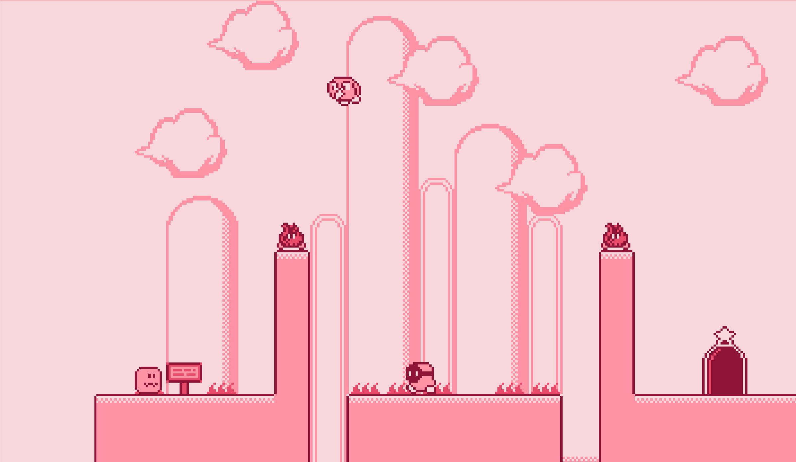

# Kirby like Platformer Game made with TypeScript + Kaboom.js

Live demo : https://jslegend.itch.io/kirby-like-platformer-asset-pack

Learn how to build this game by following my tutorial : https://www.youtube.com/watch?v=rICeqnbzkZk

Everything was made by me including the art which you can use in your games.

## How to run the project ?

Assuming you have `node` installed.
- Install dependencies with `npm install`
- Run locally with `npm run dev`
- Build for production with `npm run build` and a dist folder should appear
